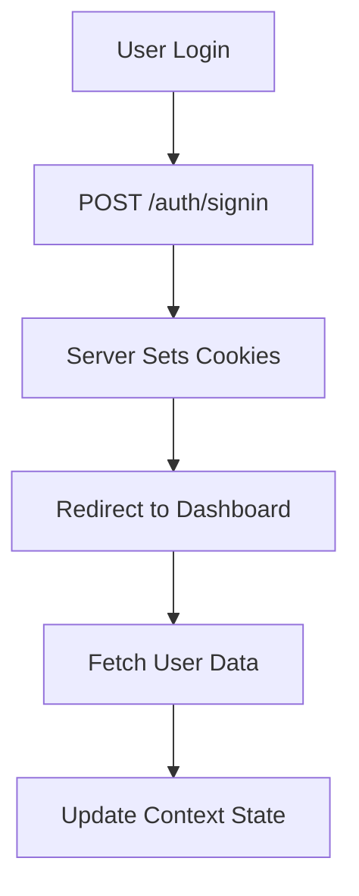
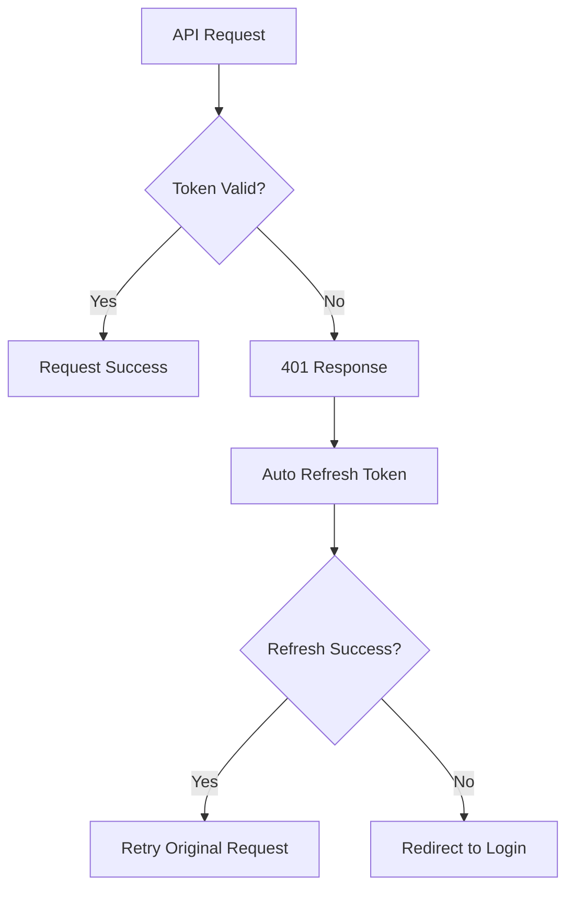

# Cookie-Based Authentication System

This document explains the secure, cookie-based authentication system implemented in this Next.js application.

## 🔐 Overview

The authentication system uses **HTTP-only cookies** for token storage, providing better security than localStorage. All authentication tokens are managed server-side and automatically included in requests.

## 🏗️ Architecture

### Components
1. **AuthContext** - React context for authentication state management
2. **API Interceptors** - Automatic token refresh and error handling
3. **Middleware** - Server-side route protection
4. **Protected Routes** - Client-side route protection
5. **Cookie Utilities** - Helper functions for cookie management

## 🔧 How It Works

### 1. Authentication Flow



### 2. Token Refresh Flow



## 🍪 Cookie Configuration

### Required Cookies
- `access_token` - JWT access token (short-lived)
- `refresh_token` - JWT refresh token (long-lived)

### Cookie Security Settings
```javascript
// Server-side cookie settings (should be set by your backend)
{
  httpOnly: true,        // Prevents XSS attacks
  secure: true,          // HTTPS only in production
  sameSite: 'strict',    // CSRF protection
  path: '/',             // Available across the app
  maxAge: 7 * 24 * 60 * 60 * 1000  // 7 days for refresh token
}
```

## 📁 File Structure

```
src/
├── context/
│   └── AuthContext.js          # Main authentication context
├── lib/
│   ├── api.js                  # Axios configuration with interceptors
│   └── cookies.js              # Cookie utility functions
├── components/
│   └── ProtectedRoute.js       # Route protection component
├── app/
│   ├── api/auth/status/
│   │   └── route.js            # Server-side auth status check
│   └── middleware.js           # Next.js middleware
└── app/(auth)/
    ├── sign-in/page.js         # Login page
    └── sign-up/page.js         # Registration page
```

## 🔒 Security Features

### 1. **HTTP-Only Cookies**
- Tokens are not accessible via JavaScript
- Prevents XSS attacks
- Automatically sent with requests

### 2. **Automatic Token Refresh**
- Seamless token renewal
- No user interruption
- Fallback to login on refresh failure

### 3. **CSRF Protection**
- SameSite cookie attribute
- Server-side validation
- Secure request handling

### 4. **Route Protection**
- Server-side middleware protection
- Client-side route guards
- Automatic redirects

## 🚀 Usage Examples

### Using the Auth Context
```jsx
import { useAuth } from "@/context/AuthContext"

function MyComponent() {
  const { user, signin, signout, isAuthenticated, loading } = useAuth()
  
  if (loading) return <LoadingSpinner />
  
  return (
    <div>
      {isAuthenticated ? (
        <p>Welcome, {user.name}!</p>
      ) : (
        <p>Please sign in</p>
      )}
    </div>
  )
}
```

### Protected Routes
```jsx
import ProtectedRoute from "@/components/ProtectedRoute"

export default function MyProtectedPage() {
  return (
    <ProtectedRoute>
      <div>This content is only visible to authenticated users</div>
    </ProtectedRoute>
  )
}
```

### API Calls
```jsx
import api from "@/lib/api"

// Cookies are automatically included
const response = await api.get("/api/protected-data")
```

## 🔧 Backend Requirements

Your backend API should:

### 1. **Set Secure Cookies**
```javascript
// Example Express.js implementation
res.cookie('access_token', token, {
  httpOnly: true,
  secure: process.env.NODE_ENV === 'production',
  sameSite: 'strict',
  maxAge: 15 * 60 * 1000 // 15 minutes
})

res.cookie('refresh_token', refreshToken, {
  httpOnly: true,
  secure: process.env.NODE_ENV === 'production',
  sameSite: 'strict',
  maxAge: 7 * 24 * 60 * 60 * 1000 // 7 days
})
```

### 2. **Handle Token Refresh**
```javascript
// POST /auth/refresh
// Should read refresh token from cookies
// Return new access token as cookie
```

### 3. **Clear Cookies on Logout**
```javascript
// POST /auth/signout
res.clearCookie('access_token')
res.clearCookie('refresh_token')
```

## 🐛 Debugging

### Check Authentication Status
```javascript
import { debugCookies } from "@/lib/cookies"

// Log all cookies (development only)
debugCookies()
```

### API Status Check
```javascript
// Check server-side auth status
const response = await fetch('/api/auth/status', {
  credentials: 'include'
})
const status = await response.json()
console.log('Auth status:', status)
```

## ⚠️ Important Notes

### 1. **CORS Configuration**
Ensure your backend allows credentials:
```javascript
// Backend CORS settings
{
  origin: 'http://localhost:3000',
  credentials: true
}
```

### 2. **Environment Variables**
```env
# Frontend
NEXT_PUBLIC_API_URL=https://your-api.com

# Backend
JWT_SECRET=your-secret-key
COOKIE_SECRET=your-cookie-secret
```

### 3. **Production Considerations**
- Use HTTPS in production
- Set secure cookie flags
- Implement proper CORS policies
- Use environment-specific configurations

## 🔄 Migration from localStorage

If migrating from localStorage:

1. **Remove localStorage calls** - All token storage is now cookie-based
2. **Update API calls** - Add `withCredentials: true` to axios
3. **Update backend** - Set HTTP-only cookies instead of JSON responses
4. **Test thoroughly** - Verify all authentication flows work

## 📚 Additional Resources

- [Next.js Middleware Documentation](https://nextjs.org/docs/app/building-your-application/routing/middleware)
- [HTTP-Only Cookies Security](https://owasp.org/www-community/HttpOnly)
- [JWT Best Practices](https://auth0.com/blog/a-look-at-the-latest-draft-for-jwt-bcp/)
- [CSRF Protection](https://owasp.org/www-community/attacks/csrf)
