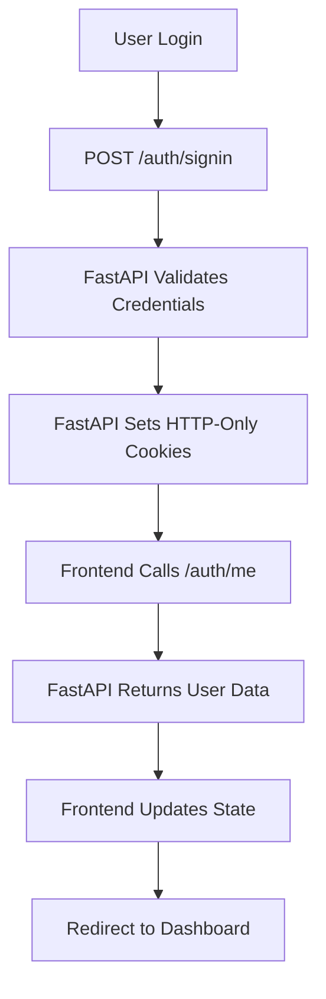
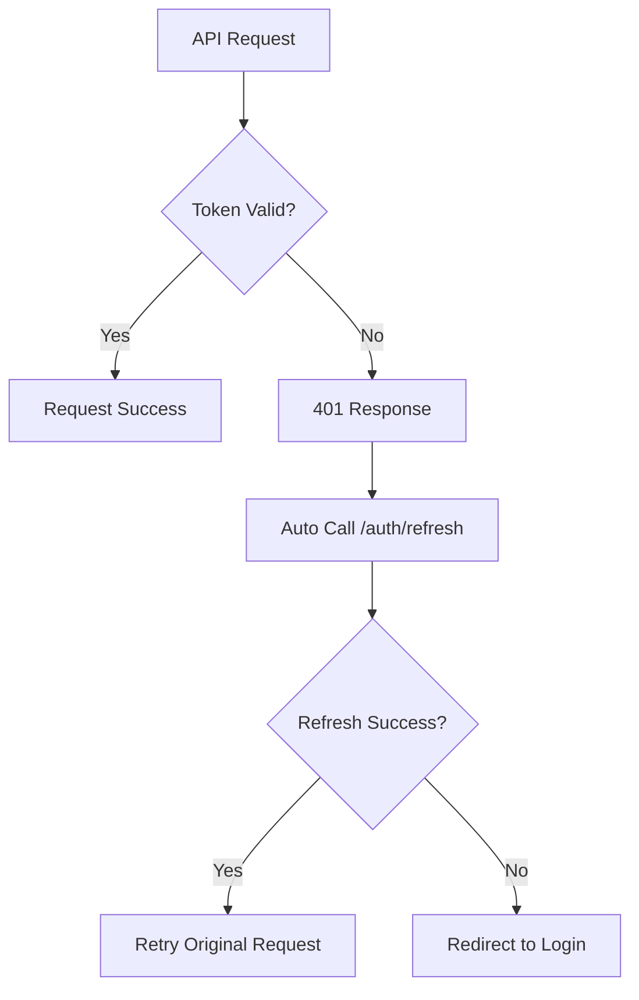

# FastAPI Backend Integration

This document explains how the Next.js frontend integrates with your FastAPI backend authentication system.

## 🔐 Overview

The frontend is now fully integrated with your FastAPI backend authentication system. All authentication operations are handled by your backend API endpoints, with the frontend relying entirely on HTTP-only cookies for secure token management.

## 🏗️ Architecture

### Backend API Endpoints
Your FastAPI backend provides these authentication endpoints:

1. **POST /auth/signup** - Create new user account
2. **POST /auth/signin** - Login user (sets HTTP-only cookies)
3. **GET /auth/me** - Get current user data
4. **POST /auth/refresh** - Refresh access token
5. **POST /auth/signout** - Logout user (clears cookies)

### Frontend Integration
- **AuthContext** - Manages authentication state and API calls
- **API Configuration** - Axios setup with automatic token refresh
- **Route Protection** - Middleware and components for secure routes
- **Error Handling** - Proper error handling for backend responses

## 🔧 How It Works

### 1. Authentication Flow



### 2. Token Refresh Flow



## 📁 File Structure

```
src/
├── context/
│   └── AuthContext.js          # Authentication context with FastAPI integration
├── lib/
│   ├── api.js                  # Axios configuration with interceptors
│   ├── utils.js                # Utility functions
│   └── validators.js           # Zod validation schemas
├── components/
│   └── ProtectedRoute.js       # Route protection component
├── app/
│   ├── (auth)/
│   │   ├── sign-in/page.js     # Login page
│   │   └── sign-up/page.js     # Registration page
│   ├── dashboard/
│   │   └── page.js             # Protected dashboard
│   ├── middleware.js           # Route protection middleware
│   └── layout.js               # Root layout with AuthProvider
```

## 🚀 Usage Examples

### Using the Auth Context
```jsx
import { useAuth } from "@/context/AuthContext"

function MyComponent() {
  const { user, signin, signout, isAuthenticated, loading } = useAuth()
  
  if (loading) return <LoadingSpinner />
  
  return (
    <div>
      {isAuthenticated ? (
        <p>Welcome, {user.name}!</p>
      ) : (
        <p>Please sign in</p>
      )}
    </div>
  )
}
```

### Authentication Operations
```jsx
import { useAuth } from "@/context/AuthContext"

function LoginForm() {
  const { signin } = useAuth()
  
  const handleLogin = async (credentials) => {
    const success = await signin(credentials)
    if (success) {
      // User is now authenticated
      // Cookies are automatically set by FastAPI backend
    }
  }
}
```

### API Calls with Automatic Refresh
```jsx
import api from "@/lib/api"

// Cookies are automatically included
// Token refresh happens automatically on 401 errors
const response = await api.get("/api/protected-data")
```

## 🔧 Configuration

### Environment Variables
Create a `.env.local` file:
```env
NEXT_PUBLIC_API_URL=https://your-fastapi-backend.com
```

### Backend CORS Configuration
Your FastAPI backend should have CORS configured to allow credentials:
```python
from fastapi.middleware.cors import CORSMiddleware

app.add_middleware(
    CORSMiddleware,
    allow_origins=["http://localhost:3000"],  # Your frontend URL
    allow_credentials=True,
    allow_methods=["*"],
    allow_headers=["*"],
)
```

## 🔒 Security Features

### 1. **HTTP-Only Cookies**
- Tokens managed entirely by FastAPI backend
- Frontend never sees or handles tokens directly
- Prevents XSS attacks

### 2. **Automatic Token Refresh**
- Axios interceptors handle 401 responses
- Automatic calls to `/auth/refresh` endpoint
- Seamless user experience

### 3. **Server-Side Validation**
- All authentication validated by FastAPI
- Frontend only displays user state
- Secure token management

### 4. **Route Protection**
- Middleware checks for auth cookies
- ProtectedRoute components for client-side protection
- Automatic redirects

## 🔄 API Integration Details

### AuthContext Functions

#### `signin(credentials)`
```javascript
// Calls POST /auth/signin
// FastAPI sets HTTP-only cookies
// Then calls GET /auth/me to get user data
const success = await signin({ email, password })
```

#### `signup(userData)`
```javascript
// Calls POST /auth/signup
// FastAPI sets HTTP-only cookies
// Then calls GET /auth/me to get user data
const success = await signup({ name, username, email, password })
```

#### `signout()`
```javascript
// Calls POST /auth/signout
// FastAPI clears cookies
// Frontend clears local state
await signout()
```

#### `fetchUser()`
```javascript
// Calls GET /auth/me
// Updates user state with response
const success = await fetchUser()
```

#### `refreshToken()`
```javascript
// Calls POST /auth/refresh
// Handles token refresh manually if needed
const success = await refreshToken()
```

### Axios Configuration
```javascript
// Automatic token refresh on 401 errors
api.interceptors.response.use(
  (response) => response,
  async (error) => {
    if (error.response?.status === 401) {
      // Call /auth/refresh automatically
      // Retry original request
    }
  }
)
```

## 🐛 Debugging

### Check Authentication Status
```javascript
// Check if user is authenticated
const { isAuthenticated, user } = useAuth()
console.log('Auth status:', isAuthenticated, user)
```

### Test Backend Connection
```javascript
// Test direct API call
const response = await fetch('https://your-backend.com/auth/me', {
  credentials: 'include'
})
const user = await response.json()
console.log('User data:', user)
```

### Check Cookies
```javascript
// In browser console
console.log('Cookies:', document.cookie)
```

## ⚠️ Important Notes

### 1. **CORS Configuration**
Ensure your FastAPI backend allows credentials:
```python
allow_origins=["http://localhost:3000"],
allow_credentials=True
```

### 2. **Cookie Settings**
Your FastAPI backend should set secure cookies:
```python
response.set_cookie(
    "access_token",
    token,
    httponly=True,
    secure=True,  # HTTPS only in production
    samesite="strict",
    max_age=900  # 15 minutes
)
```

### 3. **Error Handling**
The frontend handles FastAPI error responses:
```javascript
// FastAPI error format
{
  "detail": "Invalid credentials"
}
```

### 4. **Production Considerations**
- Use HTTPS in production
- Set secure cookie flags
- Configure proper CORS origins
- Use environment variables for API URLs

## 🔄 Migration from Previous System

### What Changed
1. **Removed server-side API routes** - No more Next.js API routes
2. **Updated AuthContext** - Now calls FastAPI endpoints directly
3. **Enhanced error handling** - Handles FastAPI error responses
4. **Automatic token refresh** - Axios interceptors for seamless refresh

### Benefits
1. **Centralized authentication** - Single source of truth in FastAPI
2. **Better security** - HTTP-only cookies managed by backend
3. **Automatic token refresh** - No manual token management
4. **Proper error handling** - FastAPI error responses handled correctly

## 📚 Additional Resources

- [FastAPI Documentation](https://fastapi.tiangolo.com/)
- [FastAPI CORS](https://fastapi.tiangolo.com/tutorial/cors/)
- [HTTP-Only Cookies](https://owasp.org/www-community/HttpOnly)
- [JWT Best Practices](https://auth0.com/blog/a-look-at-the-latest-draft-for-jwt-bcp/)
