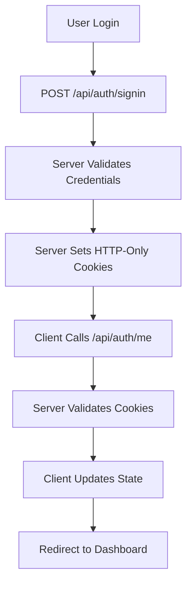
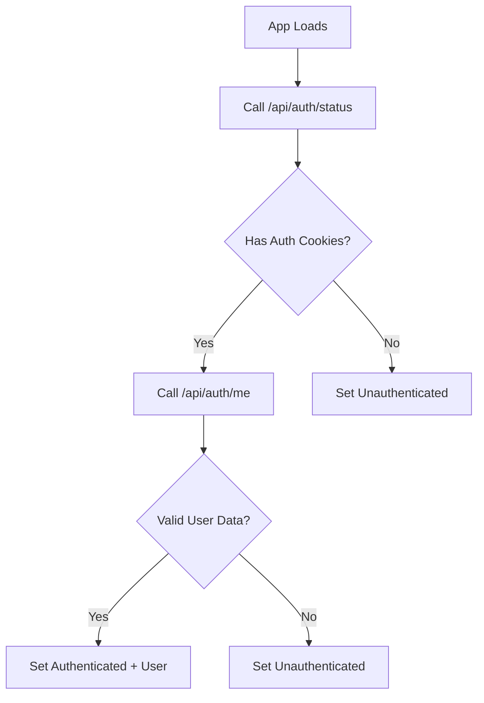

# Server-Managed Authentication System

This document explains the secure, server-managed authentication system implemented in this Next.js application.

## 🔐 Overview

The authentication system is **completely server-managed** using HTTP-only cookies. The client never handles tokens directly - it only checks authentication status through server endpoints and lets the server manage all token operations.

## 🏗️ Architecture

### Key Principles
1. **Server-Only Token Management**: All tokens are managed server-side via HTTP-only cookies
2. **Client-Only Status Checking**: Client only checks if user is authenticated via `/api/auth/me`
3. **No Client-Side Token Storage**: Zero localStorage/sessionStorage usage
4. **Automatic Cookie Handling**: Cookies are automatically sent with requests

### Components
1. **Server API Routes** - Handle authentication operations
2. **AuthContext** - Manages client-side authentication state
3. **Middleware** - Server-side route protection
4. **Protected Routes** - Client-side route guards

## 🔧 How It Works

### 1. Authentication Flow



### 2. Authentication Check Flow



## 📁 File Structure

```
src/
├── app/
│   ├── api/auth/
│   │   ├── me/route.js           # Get user data
│   │   ├── signin/route.js       # Login endpoint
│   │   ├── signup/route.js       # Registration endpoint
│   │   ├── signout/route.js      # Logout endpoint
│   │   └── status/route.js       # Check auth status
│   └── middleware.js             # Route protection
├── context/
│   └── AuthContext.js            # Client auth state
└── components/
    └── ProtectedRoute.js         # Route protection
```

## 🔒 Security Features

### 1. **HTTP-Only Cookies**
- Tokens completely inaccessible via JavaScript
- Prevents XSS attacks
- Automatically sent with requests

### 2. **Server-Side Token Management**
- Client never sees or handles tokens
- Server validates all authentication
- Secure token storage

### 3. **Automatic Cookie Handling**
- No manual token management
- Browser handles cookie transmission
- Built-in security features

### 4. **Route Protection**
- Server-side middleware protection
- Client-side route guards
- Automatic redirects

## 🚀 Usage Examples

### Using the Auth Context
```jsx
import { useAuth } from "@/context/AuthContext"

function MyComponent() {
  const { user, signin, signout, isAuthenticated, loading } = useAuth()
  
  if (loading) return <LoadingSpinner />
  
  return (
    <div>
      {isAuthenticated ? (
        <p>Welcome, {user.name}!</p>
      ) : (
        <p>Please sign in</p>
      )}
    </div>
  )
}
```

### Protected Routes
```jsx
import ProtectedRoute from "@/components/ProtectedRoute"

export default function MyProtectedPage() {
  return (
    <ProtectedRoute>
      <div>This content is only visible to authenticated users</div>
    </ProtectedRoute>
  )
}
```

### Authentication Operations
```jsx
import { useAuth } from "@/context/AuthContext"

function LoginForm() {
  const { signin } = useAuth()
  
  const handleLogin = async (credentials) => {
    const success = await signin(credentials)
    if (success) {
      // User is now authenticated
      // Cookies are automatically set by server
    }
  }
}
```

## 🔧 Server API Routes

### 1. **GET /api/auth/me**
Returns user data if authenticated:
```javascript
// Returns user object or 401 if not authenticated
{
  id: '1',
  name: 'John Doe',
  email: 'john@example.com',
  username: 'johndoe'
}
```

### 2. **POST /api/auth/signin**
Handles user login:
```javascript
// Request body
{
  email: 'user@example.com',
  password: 'password'
}

// Response: Sets HTTP-only cookies and returns success message
```

### 3. **POST /api/auth/signup**
Handles user registration:
```javascript
// Request body
{
  name: 'John Doe',
  username: 'johndoe',
  email: 'user@example.com',
  password: 'password'
}

// Response: Sets HTTP-only cookies and returns success message
```

### 4. **POST /api/auth/signout**
Handles user logout:
```javascript
// Clears authentication cookies
// Returns success message
```

### 5. **GET /api/auth/status**
Checks authentication status:
```javascript
// Returns authentication status
{
  authenticated: true,
  hasAccessToken: true,
  hasRefreshToken: true
}
```

## 🍪 Cookie Configuration

### Required Cookies
- `access_token` - JWT access token (short-lived)
- `refresh_token` - JWT refresh token (long-lived)

### Cookie Security Settings
```javascript
// Server-side cookie settings
{
  httpOnly: true,        // Prevents XSS attacks
  secure: true,          // HTTPS only in production
  sameSite: 'strict',    // CSRF protection
  path: '/',             // Available across the app
  maxAge: 15 * 60        // 15 minutes for access token
}
```

## 🔄 Migration from Client-Managed Tokens

### Before (Client-Managed)
```javascript
// ❌ Client handling tokens
localStorage.setItem('token', token)
const token = localStorage.getItem('token')
axios.defaults.headers.Authorization = `Bearer ${token}`
```

### After (Server-Managed)
```javascript
// ✅ Server handles everything
// Client only checks authentication status
const { isAuthenticated, user } = useAuth()
// Cookies are automatically sent with requests
```

## 🐛 Debugging

### Check Authentication Status
```javascript
// Check server-side auth status
const response = await fetch('/api/auth/status', {
  credentials: 'include'
})
const status = await response.json()
console.log('Auth status:', status)
```

### Check User Data
```javascript
// Get user data
const response = await fetch('/api/auth/me', {
  credentials: 'include'
})
const user = await response.json()
console.log('User data:', user)
```

## ⚠️ Important Notes

### 1. **CORS Configuration**
Ensure your backend allows credentials:
```javascript
// Backend CORS settings
{
  origin: 'http://localhost:3000',
  credentials: true
}
```

### 2. **Environment Variables**
```env
# Frontend
NEXT_PUBLIC_API_URL=https://your-api.com

# Backend
JWT_SECRET=your-secret-key
COOKIE_SECRET=your-cookie-secret
```

### 3. **Production Considerations**
- Use HTTPS in production
- Set secure cookie flags
- Implement proper CORS policies
- Use environment-specific configurations

## 🔒 Security Benefits

1. **XSS Protection**: Tokens completely inaccessible via JavaScript
2. **CSRF Protection**: SameSite cookie attributes
3. **No Client-Side Storage**: Eliminates localStorage vulnerabilities
4. **Server-Side Validation**: All authentication validated server-side
5. **Automatic Token Management**: No manual token handling required

## 📚 Additional Resources

- [Next.js API Routes](https://nextjs.org/docs/api-routes/introduction)
- [HTTP-Only Cookies Security](https://owasp.org/www-community/HttpOnly)
- [JWT Best Practices](https://auth0.com/blog/a-look-at-the-latest-draft-for-jwt-bcp/)
- [CSRF Protection](https://owasp.org/www-community/attacks/csrf)
